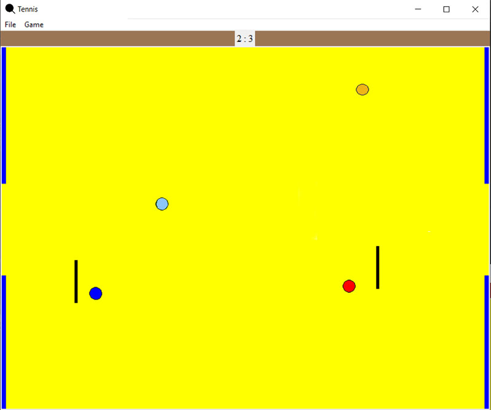

# 🏓 Tkinter Tennis Game (Client-Server)

A lightweight 2-player tennis game built with **Tkinter** and **socket programming**. showcasing real-time multiplayer gameplay implemented solely with Python’s standard library. The client–server architecture cleanly separates rendering and game logic from networking, making the codebase easy to maintain and extend.
---

## 🖥️ Requirements

This project does **not require any external Python packages**.  
It runs entirely using the Python standard library (e.g. `tkinter`, `socket`, `threading`, etc.).

Tested on **Python 3.9+**.

---

## 🎮 Features

- GUI-based gameplay using **Tkinter**
- Real-time multiplayer over LAN/internet
- Client–Server architecture for synchronized game state
- Smooth paddle and ball animation
- Ball movement simulates the **effect of gravity**
- Simple yet engaging game mechanics

---

## 🚀 Getting Started
### 1. Clone the repository
    git clone https://github.com/alexkanav/Tennis-game-python
    cd Tennis-game-python

### 2. Start the server
    python -m server.run

### 3. Start the client(s)
    python -m client.run

Make sure both the server and clients are on the same network or adjust IP addresses in the code accordingly.

---

## 🕹️ Controls
Use the mouse to move the paddles on the game field.
The game starts automatically when both players are connected.

---

## 📸 Screenshots

---

## 📖 License
This project is open source. Use it freely, or modify it for your needs.

